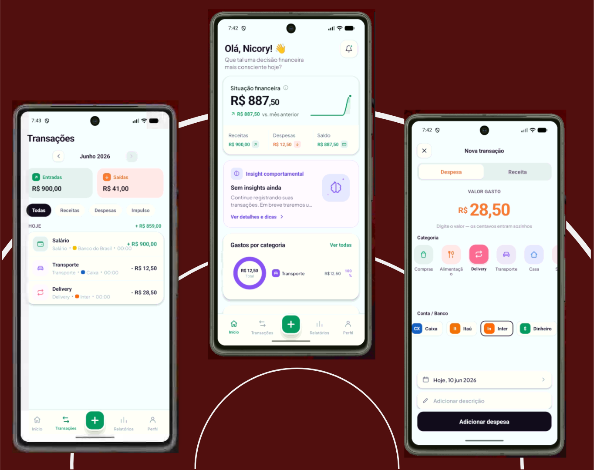

<p align="center">
  
</p>

<h1 align="center">Wyden</h1>

<p align="center">
  <strong>Finanças pessoais com análise comportamental.</strong><br/>
  Não só <em>onde</em> você gasta — <em>por que</em> você gasta assim.
</p>

<p align="center">
  
  
  
  
  
</p>

---

## ✨ O que é

A maioria dos apps de banco responde *"para onde foi seu dinheiro?"*. O **Wyden**
responde *"por que você está gastando assim?"* — gerando **insights comportamentais**
(impulsividade, gastos emocionais, consistência, planejamento) a partir das suas
transações. A cor **roxa** é reservada exclusivamente para essa parte — é a marca
visual do diferencial.

> 🎓 Projeto desenvolvido como **trabalho de faculdade**. Foi onde aprendi, na
> prática, a amarrar mobile + API + banco + infraestrutura num produto só.

## 🧱 Stack

| Camada | Tecnologias |
|--------|-------------|
| **Mobile** | React Native · Expo · TypeScript · Expo Router · React Query · React Hook Form + Zod · react-native-svg |
| **API** | NestJS · TypeORM · JWT (access + refresh) · bcrypt · class-validator · throttler |
| **Dados** | PostgreSQL 16 · Redis 7 |
| **Infra** | Docker + docker-compose · Nginx · GitHub Actions (CI local-first) |

## 📂 Monorepo (npm workspaces)

```
apps/mobile      App React Native (Expo)        → apps/mobile/CLAUDE.md
apps/api         Backend NestJS                 → apps/api/CLAUDE.md
packages/shared  Tipos/enums compartilhados
```

## ▶️ Rodando local

Pré-requisitos: Node.js, npm e Docker Desktop.

```bash
npm install               # na raiz

npm run docker:up         # sobe postgres, redis, api, pgadmin
# API em http://localhost:3000/api/v1 (cria o schema + seed no 1º boot)

npm run mobile            # abre o Expo
```

No **emulador Android**, use `EXPO_PUBLIC_API_URL=http://10.0.2.2:3000/api/v1`
(o `localhost` do emulador aponta para ele mesmo).

> Crie uma conta na tela de **Registro** → você já entra com 15 categorias e 6
> contas. Adicione transações pelo botão **+**.

## 🧪 Qualidade

```bash
npm run ci   # typecheck + lint + test + build (api + mobile)
```

Pipeline **local-first**: o mesmo `npm run ci` roda na sua máquina, no
`.github/workflows/ci.yml` e no hook de pre-push. Hoje: **188 testes** unitários
(95 backend + 93 mobile).

## 📚 Documentação

- **[`RESUMO.md`](RESUMO.md)** — o "livro" do projeto: o que é cada coisa, por quê,
  como se conecta e todas as chaves/credenciais de dev.
- **[`DEPLOY.md`](DEPLOY.md)** — checklist de produção (subir numa VPS com
  Docker + Nginx + HTTPS e apontar o app).
- Cada pasta importante tem seu próprio `CLAUDE.md` com as regras da área.

## 👤 Autor

**Pedro Nicory** — [nicoryy.com](https://nicoryy.com)

<sub>Projeto acadêmico; pretendo evoluí-lo e usar pessoalmente.</sub>
