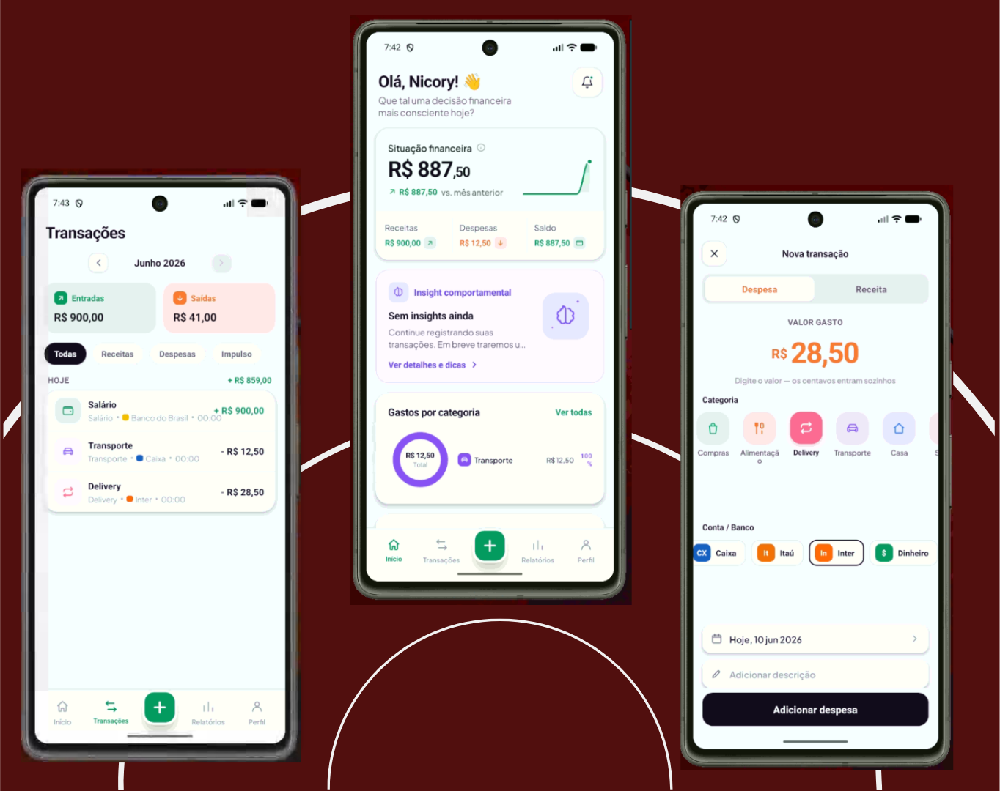

<p align="center">
  
</p>

<h1 align="center">Wyden</h1>

<p align="center">
  <strong>Finanças pessoais com análise comportamental.</strong><br/>
  Não só <em>onde</em> você gasta — <em>por que</em> você gasta assim.
</p>

<p align="center">
  
  
  
</p>

---

## ✨ O que é

A maioria dos apps de banco responde *"para onde foi seu dinheiro?"*. O **Wyden**
responde *"por que você está gastando assim?"* — gerando **insights comportamentais**
(impulsividade, gastos emocionais, consistência, planejamento) a partir das suas
transações. A cor **roxa** é reservada exclusivamente para essa parte — é a marca
visual do diferencial.

**100% local e offline**: é um app pessoal, de um único usuário, e seus dados
bancários não têm por que sair do seu aparelho. Não há servidor, não há login —
só o app e um banco SQLite local. Backup é um arquivo `.json` que você mesmo
exporta e importa quando quiser.

> 🎓 Projeto desenvolvido como **trabalho de faculdade**. Foi onde aprendi, na
> prática, a levar um produto do zero até uma arquitetura enxuta o bastante
> para não precisar de infraestrutura nenhuma.

## 🧱 Stack

| Camada | Tecnologias |
|--------|-------------|
| **Mobile** | React Native · Expo · TypeScript · Expo Router · React Query · React Hook Form + Zod · react-native-svg |
| **Dados** | SQLite local (`expo-sqlite`) — sem servidor, sem nuvem |
| **Backup** | Exportar/importar `.json` (`expo-file-system` + `expo-sharing` + `expo-document-picker`) |
| **CI** | GitHub Actions (local-first: `npm run ci` roda igual na sua máquina) |

## 📂 Monorepo (npm workspaces)

```
apps      App React Native (Expo), com o banco local embutido → apps/CLAUDE.md
```

## ▶️ Rodando local

Pré-requisitos: Node.js e npm. Nada de Docker.

```bash
npm install      # na raiz
npm run mobile    # abre o Expo
```

> Na primeira abertura, o app pede só o seu nome (sem conta, sem e-mail, sem
> senha) e já vem com 15 categorias e 6 contas padrão. Adicione transações
> pelo botão **+**.

## 🧪 Qualidade

```bash
npm run ci   # typecheck + lint + test + build (mobile)
```

Pipeline **local-first**: o mesmo `npm run ci` roda na sua máquina, no
`.github/workflows/ci.yml` e no hook de pre-push. Hoje: **125 testes**
unitários, incluindo a camada de dados local sobre um SQLite real em memória
(`sql.js`, sem mocks de banco).

## 📚 Documentação

- **[`RESUMO.md`](RESUMO.md)** — o "livro" do projeto: o que é cada coisa, por quê,
  e como se conecta.
- Cada pasta importante tem seu próprio `CLAUDE.md` com as regras da área.

## 👤 Autor

**Pedro Nicory** — [nicoryy.com](https://nicoryy.com)

<sub>Projeto acadêmico; pretendo evoluí-lo e usar pessoalmente.</sub>
